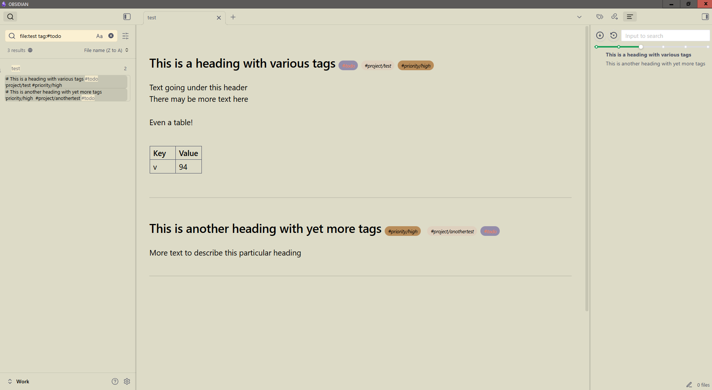
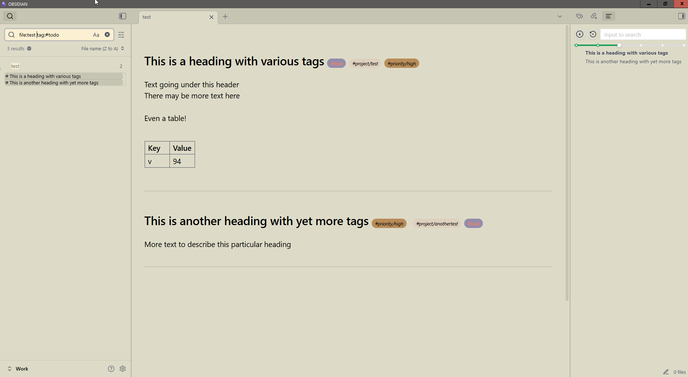
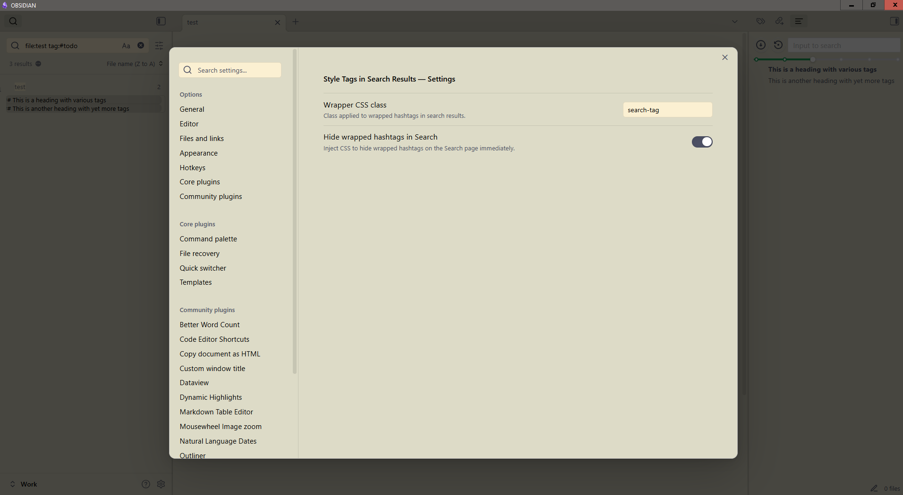

# Style Tags in Search Results

[An Obsidian plugin](https://obsidian.md) that decorates tags in search results with a CSS class. Optionally it one-click hides them using injected CSS.

## Features

- Adds a CSS class to tags in search results (customizable, default ".search-tag") to enable styling/modifying them visually with custom CSS.

- One-click hides tags from search results

## Usage and examples
The main use case for this is to declutter the search result pane if you use tags right after text to decorate headings in your notes. Then, when searching for them (for example by clicking on tag), it's a lot cleaner to just see the heading itself instead of it suffixed with all its tags.

Example:

Normally the search pane shows all the headings' tags making those lines long and possibly wrap around, limiting readability:

After enabling the plugin the tags in search results are hidden for a cleaner display:

The settings dialog allows editing the CSS class being used and toggling the automatic tag hiding.

## Provenance
This plugin was authored by [Fanis Hatzidakis](https://fanis.hatzidakis.org) with assistance from large-language-model tooling (ChatGPT). 
All code was reviewed, tested, and adapted by Fanis.
